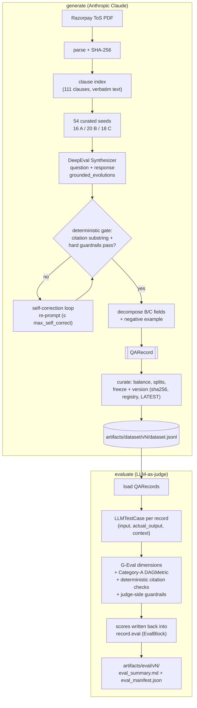

# Razorpay ToS Q&A Dataset Pipeline

> A pipeline that generates a **synthetic Q&A training dataset** for a Razorpay Terms-of-Use
> compliance assistant — one that answers clearly when it can, asks a targeted clarifying
> question when context is missing, and honestly flags genuine ambiguity instead of guessing.

## Highlights

- **54 grounded records** across the three target behaviours — **16 A / 20 B / 18 C** — above the 45-minimum / 15-per-category bar, weighted toward the harder B/C judgment cases. Splits: 38 train / 7 val / 9 test. Eval composite: **0.606**, citation gate: **100%**.
- **Split judge/generator:** the `Synthesizer` generates on Claude Haiku 4.5; `GEval` + `DAGMetric` judge on GPT-4.1 (separate model family eliminates self-preference bias).
- **Verifiable grounding:** every citation's `quoted_text` is a verbatim substring of the parsed clause (100% pass), enforced as a hard gate.
- **Defense-in-depth:** LLM-free guardrails on inputs, outputs, and the judge; a bounded self-correction loop re-grounds any record that fails the gate.
- **Reproducible artifacts:** content-hashed, versioned datasets (`sha256` + append-only registry + `LATEST` pointer + git provenance) linked to their eval runs.
- **Compliance-grade schema:** Pydantic v2 with enums + cross-field validators that enforce the A/B/C contract.

## The three behaviours


| Cat                            | When                                                      | The assistant should…                                               |
| ------------------------------ | --------------------------------------------------------- | ------------------------------------------------------------------- |
| **A — Clear answer**           | the ToS answers explicitly                                | answer directly + cite the clause                                   |
| **B — Clarification required** | the answer depends on missing context                     | ask **one** targeted clarifying question + say what it would change |
| **C — Genuine ambiguity**      | the ToS is silent / vague / defers to external regulation | flag uncertainty, state what's known, recommend escalation          |


## Install

```bash
python3.12 -m venv .venv && source .venv/bin/activate
pip install -e .                       # installs deepeval + anthropic
echo "ANTHROPIC_API_KEY=sk-ant-..." > .env
```

## Usage

```bash
python -m razorpay_qa generate         # PDF → Synthesizer → verify → curate → freeze
python -m razorpay_qa evaluate         # G-Eval + deterministic checks → eval_summary.md
```

Outputs land under `artifacts/`, split by concern and versioned per run:


| Path                                      | Contents                                                                                                 |
| ----------------------------------------- | -------------------------------------------------------------------------------------------------------- |
| `dataset/vN/`                             | `dataset.jsonl`, `dataset_card.md`, `run_manifest.json` (incl. `dataset_sha256` + git provenance)        |
| `dataset/versions.json`, `dataset/LATEST` | append-only version registry + newest-version pointer                                                    |
| `eval/vN/`                                | `eval_summary.md`, `dataset_evaluated.jsonl`, `eval_manifest.json` (records the judged `dataset_sha256`) |
| `source/`                                 | parsed ToS text + hash (regenerable cache)                                                               |


Top-level `dataset/dataset.jsonl` and `eval/eval_summary.md` are latest-run convenience copies.

## Architecture

The `evaluate` phase **consumes the `QARecord`** produced by `generate`: each record becomes a
DeepEval `LLMTestCase`, the G-Eval judge + Category-A `DAGMetric` + deterministic checks score it,
and the scores are written **back into `record.eval`** — the judge is not a separate artifact.




## How it works

- **Deterministic (pure code):** 
  - PDF parse (content-hashed)
  - Clause indexing: the curated seed clause-groups + A/B/C categories + verified C labels, citation grounding/verification (verbatim substring), dedup, review sampling, and stratified train/val/test splits
  - Seeding: A single `--seed` (default `7`) feeds sampling/ordering/splits and is recorded in `run_manifest.json` and on every record.
- **Non-deterministic (LLM):** 
  - Synthetic Dataset: The questions, answers, clarifying questions, and ambiguity narratives are model-generated, and G-Eval scores are model-judged
  - Even at `temperature=0`, re-running yields different phrasings — but the **same grounding, category, and citations**.
- **Schema:** 
  - Each JSONL record is a `QARecord` (`src/razorpay_qa/schema.py`) — a unified `response` plus decomposed fields (`answer`/`clarifying_question`/`decision_factors`/`known_facts`/`uncertainty_reason`/`recommendation`), a contrastive `negative_example`, verifiable `citations[]`, `safety_flags`, legal context, full `provenance`, and an `eval` write-back block.

DeepEval does the heavy lifting (`Synthesizer.generate_goldens_from_contexts` for generation,
`GEval` + `DAGMetric` for judging, on `AnthropicModel`)

A thin decomposition step (merged into `generation.py`) re-expresses each B/C response into the structured schema fields, and pure-code guardrails (`utils/guardrails.py`) screen inputs, outputs, and the judge.

## Repo map

```
config/        pipeline.yaml (model, seed, counts, evolutions), taxonomy.yaml (enums)
src/razorpay_qa/
  __init__.py __main__.py
  cli.py                    # `python -m razorpay_qa generate|evaluate`
  generation.py             # Synthesizer + self-correction + B/C decomposition + postprocess
  evaluation.py             # G-Eval judge + DAGMetric + async scoring + curate/freeze/version
  utils/
    config.py schema.py llm.py seeds.py   # shared helpers (LLM factory, Pydantic schema, seeds)
    ingest.py                              # PDF→text+hash, clause index
    guardrails.py                          # input/output (generation) + judge-error (eval) guardrails
tests/         schema validators, clause index, seed/citation integrity, guardrails, self-correction
docs/          setup.md, runbook-generate.md, runbook-evaluate.md
artifacts/     source/, dataset/vN/, eval/vN/
```

## Docs & further reading

- `[docs/setup.md](docs/setup.md)`, `[docs/runbook-generate.md](docs/runbook-generate.md)`, `[docs/runbook-evaluate.md](docs/runbook-evaluate.md)` — setup + per-stage runbooks.
- `[docs/PROCESS.md](docs/PROCESS.md)` — full design-decision log (newest first).

## Safety / legal

Razorpay's ToS is copyrighted; only short verbatim quotes are stored for grounding. Scenarios
use synthetic merchants (no PII). Outputs are informational, not legal advice.

## Process

The full design-decision log lives in **[docs/PROCESS.md](docs/PROCESS.md)** (preserved, newest-first).