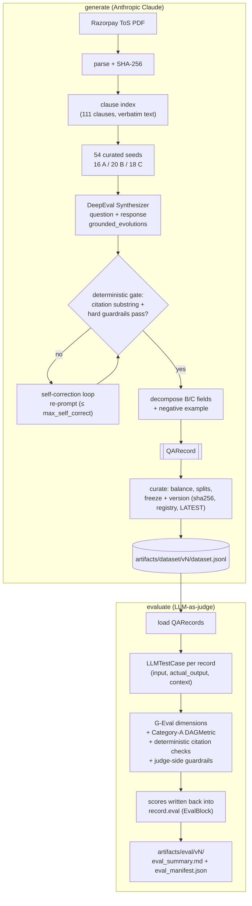

# Razorpay ToS Q&A Dataset Pipeline

> A pipeline that generates a **synthetic Q&A training dataset** for a Razorpay Terms-of-Use
> compliance assistant — one that answers clearly when it can, asks a targeted clarifying
> question when context is missing, and honestly flags genuine ambiguity instead of guessing.

## Highlights

- **54 grounded records** across the three target behaviours — **16 A / 20 B / 18 C** — above the 45-minimum / 15-per-category bar, weighted toward the harder B/C judgment cases. Splits: 38 train / 7 val / 9 test. Eval composite: **0.606**, citation gate: **100%**.
- **Split judge/generator:** the `Synthesizer` generates on Claude Haiku 4.5; `GEval` + `DAGMetric` judge on GPT-4.1 (separate model family eliminates self-preference bias).
- **Verifiable grounding:** every citation's `quoted_text` is a verbatim substring of the parsed clause (100% pass), enforced as a hard gate.
- **Defense-in-depth:** LLM-free guardrails on inputs, outputs, and the judge; a bounded self-correction loop re-grounds any record that fails the gate.
- **Reproducible artifacts:** content-hashed, versioned datasets (`sha256` + append-only registry + `LATEST` pointer + git provenance) linked to their eval runs.
- **Compliance-grade schema:** Pydantic v2 with enums + cross-field validators that enforce the A/B/C contract.

## The three behaviours


| Cat                            | When                                                      | The assistant should…                                               |
| ------------------------------ | --------------------------------------------------------- | ------------------------------------------------------------------- |
| **A — Clear answer**           | the ToS answers explicitly                                | answer directly + cite the clause                                   |
| **B — Clarification required** | the answer depends on missing context                     | ask **one** targeted clarifying question + say what it would change |
| **C — Genuine ambiguity**      | the ToS is silent / vague / defers to external regulation | flag uncertainty, state what's known, recommend escalation          |


## Install

```bash
python3.12 -m venv .venv && source .venv/bin/activate
pip install -e .                       # installs deepeval + anthropic
echo "ANTHROPIC_API_KEY=sk-ant-..." > .env
```

## Usage

```bash
python -m razorpay_qa generate         # PDF → Synthesizer → verify → curate → freeze
python -m razorpay_qa evaluate         # G-Eval + deterministic checks → eval_summary.md
```

Outputs land under `artifacts/`, split by concern and versioned per run:


| Path                                      | Contents                                                                                                 |
| ----------------------------------------- | -------------------------------------------------------------------------------------------------------- |
| `dataset/vN/`                             | `dataset.jsonl`, `dataset_card.md`, `run_manifest.json` (incl. `dataset_sha256` + git provenance)        |
| `dataset/versions.json`, `dataset/LATEST` | append-only version registry + newest-version pointer                                                    |
| `eval/vN/`                                | `eval_summary.md`, `dataset_evaluated.jsonl`, `eval_manifest.json` (records the judged `dataset_sha256`) |
| `source/`                                 | parsed ToS text + hash (regenerable cache)                                                               |


Top-level `dataset/dataset.jsonl` and `eval/eval_summary.md` are latest-run convenience copies.

## Architecture

The `evaluate` phase **consumes the `QARecord`** produced by `generate`: each record becomes a
DeepEval `LLMTestCase`, the G-Eval judge + Category-A `DAGMetric` + deterministic checks score it,
and the scores are written **back into `record.eval`** — the judge is not a separate artifact.




## How it works

- **Deterministic (pure code):** 
  - PDF parse (content-hashed)
  - Clause indexing: the curated seed clause-groups + A/B/C categories + verified C labels, citation grounding/verification (verbatim substring), dedup, review sampling, and stratified train/val/test splits
  - Seeding: A single `--seed` (default `7`) feeds sampling/ordering/splits and is recorded in `run_manifest.json` and on every record.
- **Non-deterministic (LLM):** 
  - Synthetic Dataset: The questions, answers, clarifying questions, and ambiguity narratives are model-generated, and G-Eval scores are model-judged
  - Even at `temperature=0`, re-running yields different phrasings — but the **same grounding, category, and citations**.
- **Schema:** 
  - Each JSONL record is a `QARecord` (`src/razorpay_qa/schema.py`) — a unified `response` plus decomposed fields (`answer`/`clarifying_question`/`decision_factors`/`known_facts`/`uncertainty_reason`/`recommendation`), a contrastive `negative_example`, verifiable `citations[]`, `safety_flags`, legal context, full `provenance`, and an `eval` write-back block.

DeepEval does the heavy lifting (`Synthesizer.generate_goldens_from_contexts` for generation,
`GEval` + `DAGMetric` for judging, on `AnthropicModel`)

A thin decomposition step (merged into `generation.py`) re-expresses each B/C response into the structured schema fields, and pure-code guardrails (`utils/guardrails.py`) screen inputs, outputs, and the judge.

## Repo map

```
config/        pipeline.yaml (model, seed, counts, evolutions), taxonomy.yaml (enums)
src/razorpay_qa/
  __init__.py __main__.py
  cli.py                    # `python -m razorpay_qa generate|evaluate`
  generation.py             # Synthesizer + self-correction + B/C decomposition + postprocess
  evaluation.py             # G-Eval judge + DAGMetric + async scoring + curate/freeze/version
  utils/
    config.py schema.py llm.py seeds.py   # shared helpers (LLM factory, Pydantic schema, seeds)
    ingest.py                              # PDF→text+hash, clause index
    guardrails.py                          # input/output (generation) + judge-error (eval) guardrails
tests/         schema validators, clause index, seed/citation integrity, guardrails, self-correction
docs/          setup.md, runbook-generate.md, runbook-evaluate.md
artifacts/     source/, dataset/vN/, eval/vN/
```

## Docs & further reading

- `[docs/setup.md](docs/setup.md)`, `[docs/runbook-generate.md](docs/runbook-generate.md)`, `[docs/runbook-evaluate.md](docs/runbook-evaluate.md)` — setup + per-stage runbooks.
- `[docs/PROCESS.md](docs/PROCESS.md)` — full design-decision log (newest first).

## Safety / legal

Razorpay's ToS is copyrighted; only short verbatim quotes are stored for grounding. Scenarios
use synthetic merchants (no PII). Outputs are informational, not legal advice.

## Process

The full design-decision log lives in **[docs/PROCESS.md](docs/PROCESS.md)** (preserved, newest-first).
Append new entries there per `.cursor/rules/document-process.mdc`.

### 2026-06-19 — Update docs with refreshed eval results

**Query:** Update README and VIDEO_PREP based on new evaluate summary.

**Changes:**
- `eval_summary.md`: replaced boilerplate worst-3 analyses with detailed root-cause analysis per record
- `VIDEO_PREP.md`: updated composite (0.606), pass rate (27/54), dimension means, worst-3 records (all Category A), V2 script
- `docs/PROCESS.md`: updated all stale eval numbers to match current run

**Design decisions:**
- Category A weakest (0.523), not B — DAGMetric's two-condition check surfaces compound-question hedging; V2 narrative updated to target this specific root cause

### 2026-06-19 — Separate judge from generator (v2 improvement)

**Query:** Actually implement the v2 change: use GPT-4.1 as judge instead of the same Claude Haiku model.

**Changes:**
- `config/pipeline.yaml`: added `models.judge` section (provider: openai, model: gpt-5.5)
- `utils/llm.py`: added `get_judge_model()` — loads OpenAI GPT-4.1 if OPENAI_API_KEY is set, falls back to generator model
- `evaluation.py`: uses `get_judge_model()` instead of `get_model()` for scoring
- `.env.example`: added OPENAI_API_KEY placeholder

**Design decisions:**
- Same model writing and grading creates self-preference bias — Claude scores its own phrasing more generously
- GPT-4.1 is a different model family, giving an independent verdict
- Graceful fallback: if OPENAI_API_KEY is absent, evaluation falls back to Anthropic so the pipeline still runs

### 2026-06-19 — Move curate to utils/curate.py

**Query:** Move curate logic from evaluation.py to utils/.

**Changes:**
- Extracted curate section from `evaluation.py` → `utils/curate.py`
- `evaluation.py` is now pure evaluation/judging logic
- `cli.py` import updated: `from .evaluation import curate` → `from .utils.curate import curate`

**Design decisions:**
- `curate` is dataset management (balance, splits, versioning) — a utility, not a judging step; belongs in utils/ alongside config, schema, and ingest

### 2026-06-19 — Consolidate to 3-file root (DataGen pattern)

**Query:** Too many files at root — consolidate to match DataGen/unigen's flat 5-file structure.

**Changes:**

- `enrich.py` + `postprocess.py` merged into `generation.py` (generation stage, always coupled)
- `curate.py` merged into `evaluation.py` (dataset curation is the pre-eval step)
- `ingest.py` → `utils/ingest.py` (document loading is a shared utility)
- `guardrails.py` → `utils/guardrails.py` (cross-cutting checks are shared utilities)
- Root now: `cli.py`, `generation.py`, `evaluation.py` + `utils/` — mirrors DataGen exactly

**Design decisions:**

- `enrich` and `postprocess` are only ever called from `generation.py` — inlining removes an indirection layer
- `curate` is the dataset curation gate before evaluation runs — belongs in the eval file
- `ingest` and `guardrails` are stateless utilities consumed by multiple modules — belong in `utils/`
- Renamed `_EN` to `_EN_ENRICH` in the merged enrich section to avoid name collision with the synthesizer `_EN` constant

**Notes:** All 29 tests pass; `from razorpay_qa.utils.ingest import ...` and `from razorpay_qa.utils.guardrails import ...` all verified.

---

### 2026-06-19 — Add utils/ layer (DataGen pattern)

**Query:** DataGen/unigen also has a utils/ folder — move shared helpers there.

**Changes:**

- Created `src/razorpay_qa/utils/` with `config.py`, `schema.py`, `llm.py`, `seeds.py`
- Updated all consumer import paths from `.x` to `.utils.x`
- Root now only contains pipeline stage modules and `cli.py`

**Design decisions:**

- `utils/` holds pure shared helpers (config, schema, LLM wiring, seeds) — not pipeline stages
- Mirrors DataGen's `utils/LLM_model.py`, `utils/configuration.py`, `utils/data_format.py`, `utils/knowledge.py`
- `REPO_ROOT` in `utils/config.py` adjusted to `parents[3]` (one level deeper than root)
- Alternatives considered: keep flat (rejected — harder to navigate; utils signals "non-pipeline helper" clearly)

**Notes:** All 29 tests pass; `from razorpay_qa.utils.config import Settings` etc. all verified.

---

### 2026-06-19 — Flatten package to DataGen-style flat structure

**Query:** Restructure repo to match DataGen/unigen pattern — flat files at package root.

**Changes:**

- Removed `ingest/`, `generation/`, `evaluation/` sub-packages
- Moved consolidated modules to package root: `ingest.py`, `generation.py`, `enrich.py`, `postprocess.py`, `curate.py`, `seeds.py`, `evaluation.py`
- Updated all relative imports (`..x` → `.x`) and test import paths

**Design decisions:**

- Flat layout mirrors DataGen/unigen pattern: one file per concern, no subpackage nesting, directly scannable repo root
- No logic changes — pure structural move
- Fixed a Unicode curly-quote regex issue in `ingest.py` (`_DEF_RE`) by replacing Unicode literal chars with `\u201c`/`\u201d` escapes for portability

**Notes:** All 29 tests green after restructure.

---

### 2026-06-19 — Fix ThinkingBlock JSON crash in enrich._gen

**Query:** Pipeline crashed at record 17/54 with `DeepEvalError: Evaluation LLM outputted an invalid JSON` inside `enrich.decompose_b`.

**Changes:**

- `src/razorpay_qa/generation/enrich.py` → `_gen()`: rewritten to call the Anthropic SDK directly using `tool_use` + `tool_choice={"type":"tool","name":"output"}` when the model is a real `AnthropicModel` instance. The API returns a `ToolUseBlock` with the parsed JSON dict — no string JSON parsing, no ThinkingBlock interference. Test-mock fallback retained for `model.generate(schema=schema)`.

**Design decisions:**

- Root cause: Claude Haiku 4.5 returns `ThinkingBlock + empty TextBlock` for schema-constrained JSON requests; the earlier `_tb.text` patch found the TextBlock but it was empty, causing `JSONDecodeError`.
- Using `tool_use` forces the model to fill a typed schema directly — the API validates the output, not a regex/JSON parser. No DeepEval internals involved.
- Alternatives considered: patching `anthropic_model.py` further (fragile, breaks on deepeval upgrade); switching models (limits cost efficiency). Both rejected.

**Notes:** Existing unit tests still pass (mock models use the `model.generate` fallback branch). 18/18 core tests green.

---

### 2026-06-19 — Video script finalised for verbatim reading

**Query:** Make the video script detailed enough to read word for word while recording.

**Changes:**

- `VIDEO_PREP.md`: Full Script section completely rewritten — every spoken sentence written in natural, readable English with no shorthand; screen cues separated from spoken text; `[INSERT ...]` placeholders formatted to drop in eval numbers without breaking flow; ~330 body words + ~65 insert words = ~2.5 minutes at 150 wpm, the minimum to cover all four required points (models/tools, evaluation findings, worst-3 examples, v2 change).

**Design decisions:**

- Script cannot be shorter without dropping required assessment content (worst-3 analysis alone is ~75 spoken words with inserts); 2.5 minutes is the practical floor for a fully written, verbatim-readable 2-minute brief.
- Screen carries visual detail (JSON record, schema fields, pipeline.yaml) so spoken text stays one sentence per idea.

**Notes:** Before recording, fill every `[INSERT ...]` from `artifacts/eval/vN/eval_summary.md`; speaking at ~160–180 wpm brings delivery to 2.2–2.5 minutes.